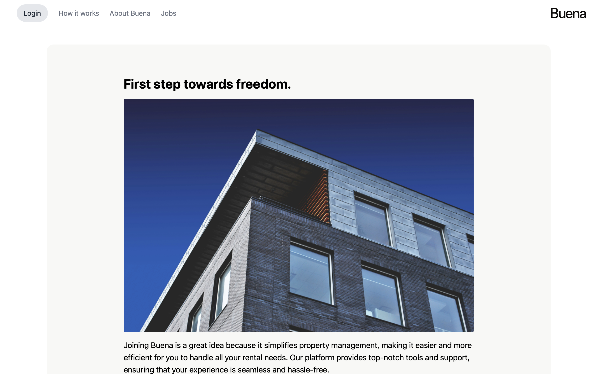

# Buena Rental Application Form




Hello everyone!
I am very pleased to present the case study to you. I am happy to report that all features, as well as all stretch goals, have been successfully implemented. In this Case Study, I tried to adapt to the modern UX the original website is providing.

## Features

- Multi-page application form
  - Personal Information
  - Contact Information
  - Salary Indication
  - Summary
- Progress Indicator (with animation the moment you click on it)
- Form validation with error messages (Every field has a validation form)
- Responsive design (if you minimize the window, we have a burgermenu popping up)
- Animations (Button Clicking, ProgressBar)
- State management with Context API and localStorage
- Notification on form submission

## Technologies Used
I used React and TypeScript with Tailwind CSS. 
The reason I chose Tailwind CSS is because the components are beautiful, and the original Buena website uses it as well. The buttons in the top left reference the actual Buena web components. Below is a list of the technologies I used:

- React
- TypeScript
- Tailwind CSS
- React Router
- React Hook Form
- Yup (for validation)
- React Toastify (for notifications)

## Improvement potential
I should have programmed more component based. In this way, I can ensure to recycle already created components, such as the round-shaped frames in every page. Since, in big applications, this can get quite confusing, it's always nice to programm component based. Besides that, the package management got messy, there are best-practices which could have been applied in the beginning to this project, like containerization. Additionally, the possibility of adding more sophisticated tests is high. In this way, I could ensure that any the User will not be able to have bad UX. 

## Setup

To run this project, install it locally using npm:

```bash
# Clone the repository
git clone https://github.com/ali6134/buena-mockdesign-as.git

# Navigate to the project directory (if necessary)
cd buena-rental-app

# Install dependencies (if necessary)
npm install

# Start the dev server
npm start

# For the tests
npm test